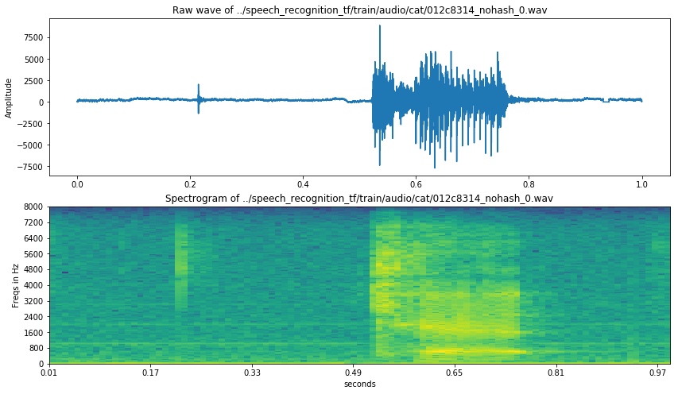

# Speech Recognition Using CNN

In this notebook I have done two things:
- Data Visualisation
- Data Analysis
- Deep Learning Model

Well I haven't made them all perfect as it was my first time to be working with audios.

I have focused my efforts on downsizing after padding/chopping the respective files.

Lets start by importing the essential libraries that we have on the system


```python
import os
from os.path import isdir, join
from pathlib import Path
import pandas as pd

# Math
import numpy as np
from scipy.fftpack import fft
from scipy import signal
from scipy.io import wavfile
import librosa

from sklearn.decomposition import PCA

# Visualization
import matplotlib.pyplot as plt
import seaborn as sns
import IPython.display as ipd
import librosa.display

import plotly.offline as py
py.init_notebook_mode(connected=True)
import plotly.graph_objs as go
import plotly.tools as tls
import pandas as pd

%matplotlib inline
```


<script>requirejs.config({paths: { 'plotly': ['https://cdn.plot.ly/plotly-latest.min']},});if(!window.Plotly) {{require(['plotly'],function(plotly) {window.Plotly=plotly;});}}</script>


So how does an audio (.wav) looks and how do we store a wave in an array. Well, we store the discreet values of the amplititude of the wave at the the different time interval. The freq(sample_rate) refers to the the number of times we the sample of amplititue in a single second. In this particular dataset the sample rate is 16000 Hz. 


```python
train_audio_path = "../speech_recognition_tf/train/audio/"
filename = '../speech_recognition_tf/train/audio/cat/012c8314_nohash_0.wav'
sample_rate,samples = wavfile.read(filename)
```

Lets define a function which takes audio as input and reconstruct the sound wave


```python
# defining a function that calculates the spectrograms

def log_specgram(audio, sample_rate, ):
    window_size=20 
    step_size = 10
    esp = 1e-10
    nperseg = int(round(window_size*sample_rate/1e3))
    noverlap = int(round(step_size*sample_rate/1e3))
    
    freqs, times, spec = signal.spectrogram(audio,
                                    fs=sample_rate,
                                    window='hann',
                                    nperseg=nperseg,
                                    noverlap=noverlap,
                                    detrend=False)
    return freqs, times, np.log(spec.T.astype(np.float32) + 1e-10)


freqs, times, spectrogram = log_specgram(samples, sample_rate)
```

Now we are going to visualise the sample audio .wav file that we read earlier 


```python
# freqs, times, spectrogram = specgram(samples, sample_rate)
fig = plt.figure(figsize=(14, 8))
ax1 = fig.add_subplot(211)
ax1.set_title('Raw wave of ' + filename)
ax1.set_ylabel('Amplitude')
ax1.plot(np.linspace(0, sample_rate/len(samples), sample_rate), samples)


ax2= fig.add_subplot(212)
ax2.imshow(spectrogram.T, aspect= "auto", origin="lower",
          extent= [times.min(), times.max(),
                  freqs.min(),freqs.max()])

ax2.set_yticks(freqs[::16])
ax2.set_xticks(times[::16])
ax2.set_title("Spectrogram of "+ str(filename))
ax2.set_ylabel("Freqs in Hz")
ax2.set_xlabel('seconds')
```


    Text(0.5,0,'seconds')





Neat! You can acctually see the wave corresponding to the sound.

- Points that can be taken from this is that a large portion of the data is blank as can be seen in the raw wave as well as in spectogram. What a good scientist would do is to compress the relevent data to save training time and accuracy.

However I'm leaving this for future as I didn't had time while making this notebook. 


```python
dirs = [f for f in os.listdir(train_audio_path) if isdir(join(train_audio_path, f))]
dirs.sort()
print('Number of labels: ' + str(len(dirs)))
```

    Number of labels: 31


so they have given 31 classes that the model needed to recognize.

# Anomaly Detection

As for this case there are following cases of anomaly that's possible
- Imbalance between the classes
- Imbalance between the length of indivisual files
  - Files can be greater than 1 sec
  - Files can be less than 1 sec


Lets check for inter-class balance


```python
# Calculate
number_of_recordings = []
for direct in dirs:
    waves = [f for f in os.listdir(join(train_audio_path, direct)) if f.endswith('.wav')]
    number_of_recordings.append(len(waves))

# Plot
data = [go.Histogram(x=dirs, y=number_of_recordings)]
trace = go.Bar(
    x=dirs,
    y=number_of_recordings,
    marker=dict(color = number_of_recordings, colorscale='Viridius', showscale=True
    ),
)
layout = go.Layout(
    title='Number of recordings in given label',
    xaxis = dict(title='Words'),
    yaxis = dict(title='Number of recordings')
)
py.iplot(go.Figure(data=[trace], layout=layout))

```


<div id="fcd68a53-36a9-412f-9e7f-4e8a4f26c827" style="height: 525px; width: 100%;" class="plotly-graph-div"></div><script type="text/javascript">require(["plotly"], function(Plotly) { window.PLOTLYENV=window.PLOTLYENV || {};window.PLOTLYENV.BASE_URL="https://plot.ly";Plotly.newPlot("fcd68a53-36a9-412f-9e7f-4e8a4f26c827", [{"marker": {"color": [6, 1713, 1731, 1733, 1746, 2359, 2352, 2357, 2372, 2372, 1742, 1750, 2353, 1746, 2364, 2375, 2357, 2367, 2370, 2367, 2377, 1734, 2369, 2380, 2356, 1733, 2373, 2375, 1745, 2377, 2376], "showscale": true, "colorscale": "Viridius"}, "type": "bar", "y": [6, 1713, 1731, 1733, 1746, 2359, 2352, 2357, 2372, 2372, 1742, 1750, 2353, 1746, 2364, 2375, 2357, 2367, 2370, 2367, 2377, 1734, 2369, 2380, 2356, 1733, 2373, 2375, 1745, 2377, 2376], "x": ["_background_noise_", "bed", "bird", "cat", "dog", "down", "eight", "five", "four", "go", "happy", "house", "left", "marvin", "nine", "no", "off", "on", "one", "right", "seven", "sheila", "six", "stop", "three", "tree", "two", "up", "wow", "yes", "zero"]}], {"yaxis": {"title": "Number of recordings"}, "xaxis": {"title": "Words"}, "title": "Number of recordings in given label"}, {"showLink": true, "linkText": "Export to plot.ly"})});</script>


```python
x_ls = []
for i in dirs:
    annon = 0
    for j in os.listdir(str(train_audio_path)+i):
        
        if j.endswith(".wav"):
            sample_rate,samples = wavfile.read(str(train_audio_path)+(str(i)+"/"+j))
            if abs(samples.shape[0]) != abs(sample_rate):
                annon +=1
    per = float(annon)*100/len(os.listdir(str(train_audio_path)+str(i)))
    x_ls.append(per)
    print("Annon in {}: {}".format(i,str(per))+"%" )
```

    /usr/local/lib/python3.5/dist-packages/scipy/io/wavfile.py:273: WavFileWarning:
    
    Chunk (non-data) not understood, skipping it.
    


    Annon in _background_noise_: 85.71428571428571%
    Annon in bed: 13.36835960303561%
    Annon in bird: 12.131715771230503%
    Annon in cat: 12.57934218118869%
    Annon in dog: 11.397479954180985%
    Annon in down: 8.77490462060195%
    Annon in eight: 10.246598639455783%
    Annon in five: 8.31565549427238%
    Annon in four: 9.021922428330523%
    Annon in go: 11.42495784148398%
    Annon in happy: 11.079219288174512%
    Annon in house: 10.857142857142858%
    Annon in left: 7.989800254993625%
    Annon in marvin: 9.621993127147766%
    Annon in nine: 8.037225042301184%
    Annon in no: 11.663157894736843%
    Annon in off: 9.079338141705557%
    Annon in on: 11.06886354034643%
    Annon in one: 11.265822784810126%
    Annon in right: 8.956485002112379%
    Annon in seven: 8.708456037021456%
    Annon in sheila: 8.996539792387543%
    Annon in six: 7.176023638666104%
    Annon in stop: 8.655462184873949%
    Annon in three: 9.040747028862478%
    Annon in tree: 12.233121754183497%
    Annon in two: 9.818794774546987%
    Annon in up: 13.178947368421053%
    Annon in wow: 12.607449856733524%
    Annon in yes: 9.255363904080774%
    Annon in zero: 7.281144781144781%


```python
data = [go.Histogram(x=dirs, y=x_ls)]
trace = go.Bar(
    x=dirs,
    y=x_ls,
    marker=dict(color = x_ls , colorscale='Viridius', showscale=True
    ),
)
layout = go.Layout(
    title='Number of recordings in given label',
    xaxis = dict(title='Words'),
    yaxis = dict(title='percentage of anomaly')
)
py.iplot(go.Figure(data=[trace], layout=layout))
```


<div id="97aefb23-1d68-4b19-a648-a55e2ce16990" style="height: 525px; width: 100%;" class="plotly-graph-div"></div><script type="text/javascript">require(["plotly"], function(Plotly) { window.PLOTLYENV=window.PLOTLYENV || {};window.PLOTLYENV.BASE_URL="https://plot.ly";Plotly.newPlot("97aefb23-1d68-4b19-a648-a55e2ce16990", [{"marker": {"color": [85.71428571428571, 13.36835960303561, 12.131715771230503, 12.57934218118869, 11.397479954180985, 8.77490462060195, 10.246598639455783, 8.31565549427238, 9.021922428330523, 11.42495784148398, 11.079219288174512, 10.857142857142858, 7.989800254993625, 9.621993127147766, 8.037225042301184, 11.663157894736843, 9.079338141705557, 11.06886354034643, 11.265822784810126, 8.956485002112379, 8.708456037021456, 8.996539792387543, 7.176023638666104, 8.655462184873949, 9.040747028862478, 12.233121754183497, 9.818794774546987, 13.178947368421053, 12.607449856733524, 9.255363904080774, 7.281144781144781], "showscale": true, "colorscale": "Viridius"}, "y": [85.71428571428571, 13.36835960303561, 12.131715771230503, 12.57934218118869, 11.397479954180985, 8.77490462060195, 10.246598639455783, 8.31565549427238, 9.021922428330523, 11.42495784148398, 11.079219288174512, 10.857142857142858, 7.989800254993625, 9.621993127147766, 8.037225042301184, 11.663157894736843, 9.079338141705557, 11.06886354034643, 11.265822784810126, 8.956485002112379, 8.708456037021456, 8.996539792387543, 7.176023638666104, 8.655462184873949, 9.040747028862478, 12.233121754183497, 9.818794774546987, 13.178947368421053, 12.607449856733524, 9.255363904080774, 7.281144781144781], "type": "bar", "x": ["_background_noise_", "bed", "bird", "cat", "dog", "down", "eight", "five", "four", "go", "happy", "house", "left", "marvin", "nine", "no", "off", "on", "one", "right", "seven", "sheila", "six", "stop", "three", "tree", "two", "up", "wow", "yes", "zero"]}], {"title": "Number of recordings in given label", "xaxis": {"title": "Words"}, "yaxis": {"title": "percentage of anomaly"}}, {"linkText": "Export to plot.ly", "showLink": true})});</script>


The following function is for fast furiour transformation 


```python
def custom_fft(y, fs):
    T = 1.0 / fs
    N = y.shape[0]
    yf = fft(y)
    xf = np.linspace(0.0, 1.0/(2.0*T), N//2)
    # FFT is simmetrical, so we take just the first half
    # FFT is also complex, to we take just the real part (abs)
    vals = 2.0/N * np.abs(yf[0:N//2])
    return xf, vals

```

The following functions will are basically to make all the audio files of same length. PADDING and CHOPPING are done in turn to make all the files of 1 sec.


```python
L=16000
def pad_audio(samples):
    L = 16000
    if len(samples) >= L: return samples
    else: return np.pad(samples, pad_width=(L - len(samples), 0), mode='constant', constant_values=(0, 0))

def chop_audio(samples, L=16000, num=20):
    for i in range(num):
        beg = np.random.randint(0, len(samples) - L)
        return (samples[beg: beg + L])
```

Now that we have ensured the required uniformity of the data, we are going to downgrade them as I am really poor, hence the 4 GB RAM. Well, as far as I know, keeping the sample rate at 16000 is of no grate use as we can actually understand the words of these clips at 8000hz as well, thus theoretically it shouldn't loose much information.

We are going to do the following:
- Downsample the audio
- Append them to the training-set


```python
downgarde_sample_rate = 8000
x_train, y_train = [], []

for i in dirs:
    for j in os.listdir(str(train_audio_path)+i):
        if j.endswith(".wav"):
            sample_rate,samples = wavfile.read(str(train_audio_path)+(str(i)+"/"+j))
            samples = pad_audio(samples)
            
            
            if len(samples)> 16000:
                samples = chop_audio(samples)
#             print(samples.shape[0])

            resampled = signal.resample(samples,  8000)
            _, _, specgram = log_specgram(resampled, 
                                  sample_rate=downgarde_sample_rate)
            
            x_train.append(specgram)
            y_train.append(i)
            
                
```

    /usr/local/lib/python3.5/dist-packages/scipy/io/wavfile.py:273: WavFileWarning:
    
    Chunk (non-data) not understood, skipping it.
    


Some label_transformation and other affine transformation


```python
x_train = np.array(x_train)
x_train = x_train.reshape(tuple(list(x_train.shape) + [1]))
```


```python
legal_labels = 'yes no up down left right on off stop go silence unknown'.split()
def label_transform(labels):
    nlabels = []
    for label in labels:
        if label == '_background_noise_':
            nlabels.append('silence')
        elif label not in legal_labels:
            nlabels.append('unknown')
        else:
            nlabels.append(label)
    return pd.get_dummies(pd.Series(nlabels))
```


```python
y_train = label_transform(y_train)
```


```python
label_index = y_train.columns.values
y_train = y_train.values
y_train = np.array(y_train)
```

The following cells describe the architecture of our model. Just like in an image, the spectrum of an audio is made up of class-unique features that can be extracted using a Convolutional Neural Network. This is just an experiment to see if our hypothesis is correct.  


```python
from keras import optimizers, losses, activations, models
from keras.layers import Convolution2D, Dense, Input, Flatten, Dropout, MaxPooling2D, BatchNormalization
from sklearn.model_selection import train_test_split
import keras
```

    /usr/local/lib/python3.5/dist-packages/h5py/__init__.py:36: FutureWarning:
    
    Conversion of the second argument of issubdtype from `float` to `np.floating` is deprecated. In future, it will be treated as `np.float64 == np.dtype(float).type`.
    
    Using TensorFlow backend.


```python
input_shape = (99, 81, 1)
nclass = 12
inp = Input(shape=input_shape)
norm_inp = BatchNormalization()(inp)
# layer-1
img_1 = Convolution2D(8, kernel_size=2, activation=activations.relu)(norm_inp)
img_1 = Convolution2D(8, kernel_size=2, activation=activations.relu)(img_1)
img_1 = MaxPooling2D(pool_size=(2, 2))(img_1)
img_1 = Dropout(rate=0.2)(img_1)
# layer-2
img_1 = Convolution2D(16, kernel_size=3, activation=activations.relu)(img_1)
img_1 = Convolution2D(16, kernel_size=3, activation=activations.relu)(img_1)
img_1 = MaxPooling2D(pool_size=(2, 2))(img_1)
img_1 = Dropout(rate=0.2)(img_1)
# layer-3
img_1 = Convolution2D(32, kernel_size=3, activation=activations.relu)(img_1)
img_1 = MaxPooling2D(pool_size=(2, 2))(img_1)
img_1 = Dropout(rate=0.2)(img_1)
img_1 = Flatten()(img_1)
# final layers
dense_1 = BatchNormalization()(Dense(128, activation=activations.relu)(img_1))
dense_1 = BatchNormalization()(Dense(128, activation=activations.relu)(dense_1))
dense_1 = Dense(nclass, activation=activations.softmax)(dense_1)

model = models.Model(inputs=inp, outputs=dense_1)
opt = optimizers.Adam()

model.compile(optimizer=opt, loss=losses.binary_crossentropy)
model.summary()


```

    _________________________________________________________________
    Layer (type)                 Output Shape              Param #   
    =================================================================
    input_2 (InputLayer)         (None, 99, 81, 1)         0         
    _________________________________________________________________
    batch_normalization_4 (Batch (None, 99, 81, 1)         4         
    _________________________________________________________________
    conv2d_6 (Conv2D)            (None, 98, 80, 8)         40        
    _________________________________________________________________
    conv2d_7 (Conv2D)            (None, 97, 79, 8)         264       
    _________________________________________________________________
    max_pooling2d_4 (MaxPooling2 (None, 48, 39, 8)         0         
    _________________________________________________________________
    dropout_4 (Dropout)          (None, 48, 39, 8)         0         
    _________________________________________________________________
    conv2d_8 (Conv2D)            (None, 46, 37, 16)        1168      
    _________________________________________________________________
    conv2d_9 (Conv2D)            (None, 44, 35, 16)        2320      
    _________________________________________________________________
    max_pooling2d_5 (MaxPooling2 (None, 22, 17, 16)        0         
    _________________________________________________________________
    dropout_5 (Dropout)          (None, 22, 17, 16)        0         
    _________________________________________________________________
    conv2d_10 (Conv2D)           (None, 20, 15, 32)        4640      
    _________________________________________________________________
    max_pooling2d_6 (MaxPooling2 (None, 10, 7, 32)         0         
    _________________________________________________________________
    dropout_6 (Dropout)          (None, 10, 7, 32)         0         
    _________________________________________________________________
    flatten_2 (Flatten)          (None, 2240)              0         
    _________________________________________________________________
    dense_4 (Dense)              (None, 128)               286848    
    _________________________________________________________________
    batch_normalization_5 (Batch (None, 128)               512       
    _________________________________________________________________
    dense_5 (Dense)              (None, 128)               16512     
    _________________________________________________________________
    batch_normalization_6 (Batch (None, 128)               512       
    _________________________________________________________________
    dense_6 (Dense)              (None, 12)                1548      
    =================================================================
    Total params: 314,368
    Trainable params: 313,854
    Non-trainable params: 514
    _________________________________________________________________


```python

x_train, x_valid, y_train, y_valid = train_test_split(x_train, y_train, test_size=0.25, random_state=2017)
model.fit(x_train, y_train, batch_size=16, validation_data=(x_valid, y_valid), epochs=3, shuffle=True, verbose=2)

```


```python
model.save(os.path.join(train_audio_path, 'cnn.model'))
```

The final model trained had an accuracy of 75%. It meant that CNN can be utilised for speech recognition tasks only if we could regularize the network in an efficient way.
